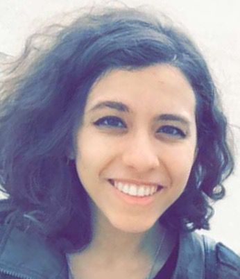

# About

I'm a senior studying electrical engineering at MIT. 
Currently, I'm working both as a Lab Assistant for the Introductory Circuits class (6.002),
and as an Undergraduate Researcher with the Responsive Environments Group at the MIT Media Lab, where I'm building an analog synthesizer.
Within electrical engineering, I am particularly interested in embedded systems and firmware architecure, as well as signals processing.
I also have an interest in probability and stochastics.

Balance between my technical work and my creative outlets are extremely important to me.
Before high school, I attended an arts school for five years studying media art, visual art, music, and theater.
Since then, I've made sure to make art a priority in my life.
I played piano and alto saxophone before college, and am improving my music knowledge and skills through both acapella and music classes.
I'm currently taking a 3D art class at the department for Art, Culture, and Technology at MIT.

I have experience working with Verilog, Assembly, C, MATLAB, Python, PureData, SPICE, and LaTeX.

I am proficient in Spanish and am learning Russian.

## Contact Me

sramos@mit.edu

[LinkedIn](https://www.linkedin.com/in/sienna-ramos-b771878b/)

