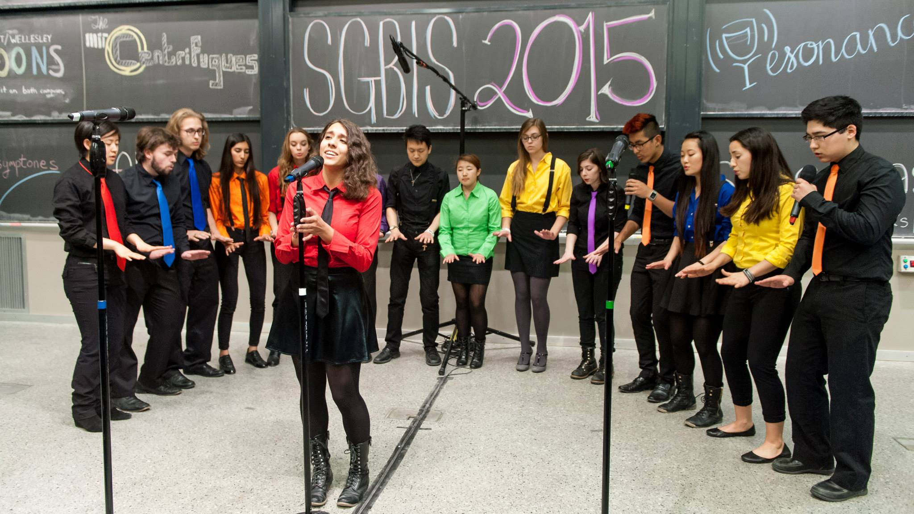
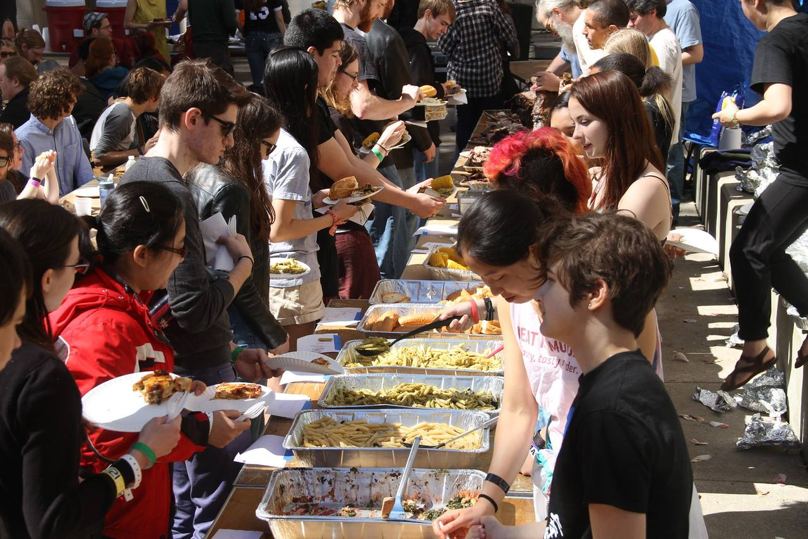
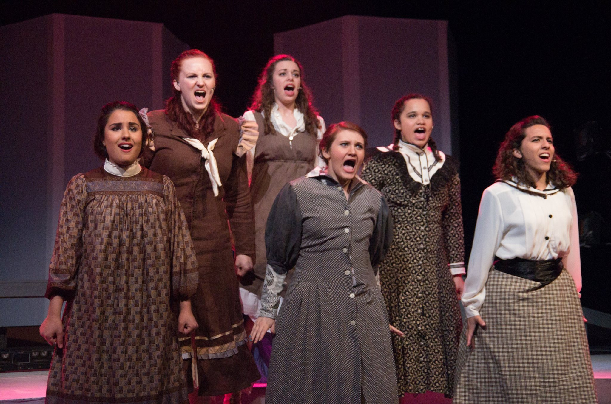

# Activities

## MIT/Wellesley Toons
September 2014-present

- President, _Spring 2016 and Spring 2017_: Represented the group, organized weekend retreat, and handled interpersonal conflicts.
- Business Manager, _Spring 2015 and Fall 2015_: Managed all group communications and logistics.
- Treasurer, _Fall 2016_: Managed group finances.
- Arrangements
	- Adder(f)all, Tei Shi _Fall 2017_
	- Past Lives, BØRNS, _Fall 2016_
	- Water, Andrew Huang, _Fall 2015_
- Solos
	- Thank You, Boys II Men, _Fall 2016 and Spring 2017_
	- Every Other Freckle, Alt-J, _Fall 2015_
	- Youth, Foxes, _Spring 2015_
	- 1901, Phoenix, _Fall 2014_

## Food Veep for Steer Roast
Spring 2015 and 2016

* Organized an annual feast for hundreds of people.
* Coordinated ~40 volunteers in various cooking activities.
* Purchase ingredients, supplies, and seating arrangments.

## Musical Theater Guild
Spring 2015 and January 2016

* Thea in _Spring Awakening_.
* Ensemble in _9 to 5_.