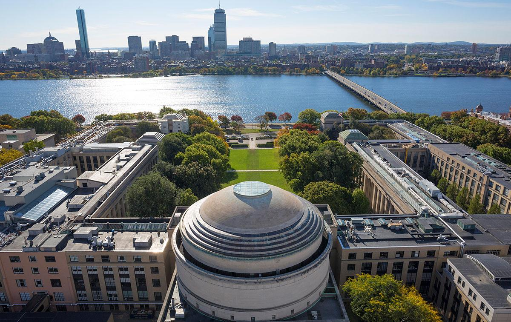

# Updates

## Start of Senior Year

I'm really excited to start my last year as an undergrad at MIT. As always, I'm keeping [busy](projects) this semester.
I'm taking a full [courseload](coursework), as well as working two [on-campus jobs](experience).
I'm still [involved](activities) with Toons, and am acclimating to a new living group. 
Can't wait to see how I'll grow this semester!

September 2017

* * *

## I'm back from India

I spent the summer in Bangalore, India, working for [Jana Care](http://www.janacare.com/),
a medical technology startup which aims to make monitoring diabetes cheaper and more convenient.
Outside of work, I was exploring South India and keeping a [travel blog](http://siennayaygoesaway.wordpress.com). 
My experience abroad was extremely valuable to me. 
I didn't just improve as an engineer;
I learned a lot about how to handle cultural differences and how to navigate an unfamiliar country.
I'll miss the food, the colors, and the people, and am looking forward to the next time I travel back.

August 2017
