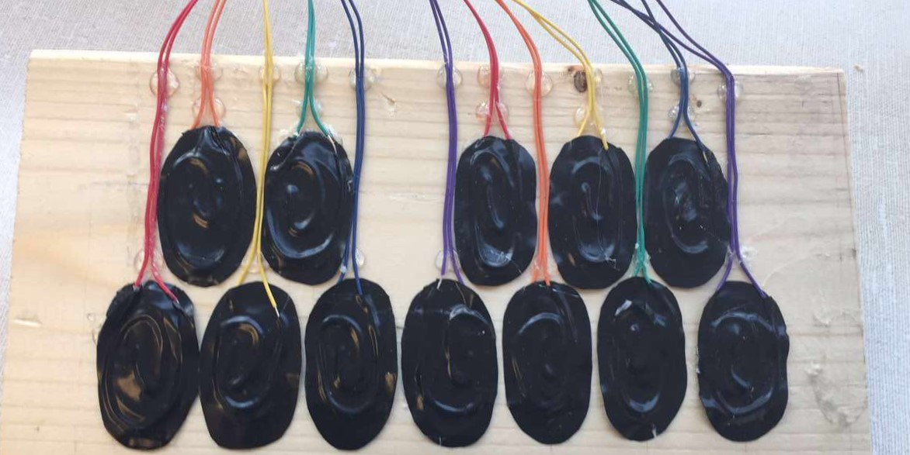
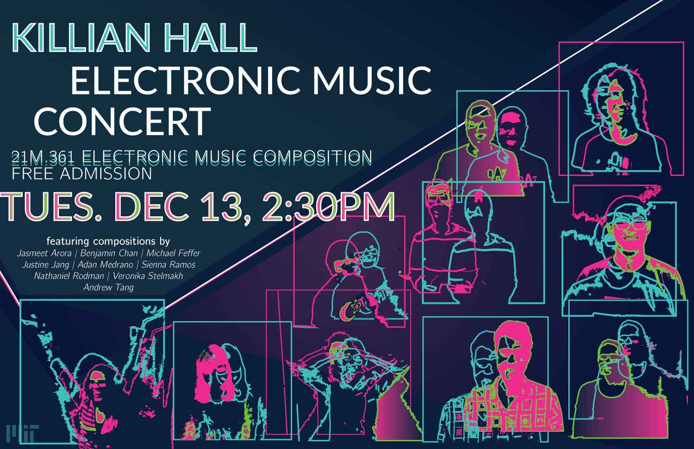
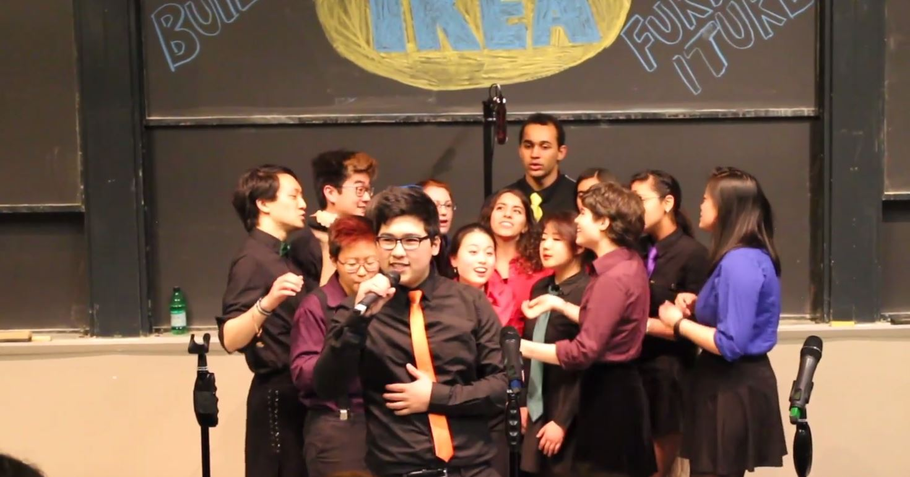
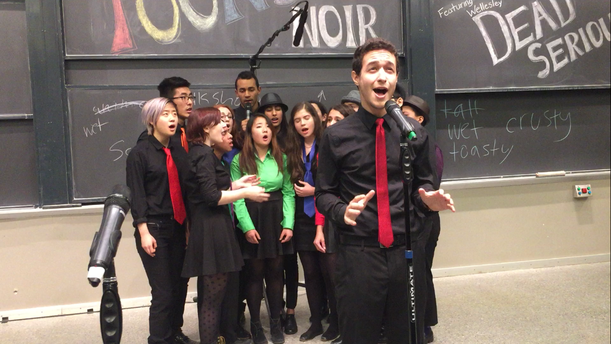
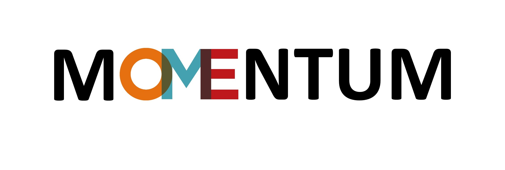
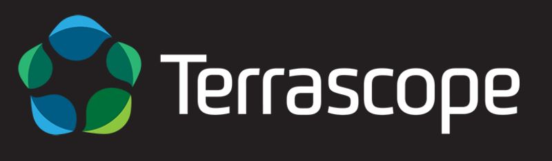

# Projects

## In Progress

### Adder(f)all
**Status:** Completed, In Rehearsal

A short, sololess arrangement for a cappella, based on [Tei Shi's Adder(f)all](https://open.spotify.com/track/3tcpDYxRmUe4O3ylYXl1xM).

### Heart-Shaped Birthmark
**Status:** Composition

A short, sololess arrangement for a cappella, based on [Tei Shi's Heart-Shaped Birthmark](https://open.spotify.com/track/28fXpBHSLHV9KFUZlYrd6i).

### TBD

**Status:** Ideation

Final Project for 6.111, Introductory Digital Systems Laboratory

### TBD

**Status:** Ideation

Final Project for 4.322, Introduction to 3D Art

## Completed

### Pressure Sensitive MIDI Controller

_May 2017_

Final Project for 6.115, Microcomputer Project Laboratory. 
I created 12 "keys" out of pressure sensitive resistor material,
and connected them to a PSoC microcontroller, which translated key and pressure information into MIDI note and volume information.
I connected a touch screen to the Intel 8051 microcontroller, 
which the user could use to select sound quality information (sine, sawtooth, or square wave), as well as the octave of the note.
All of this information was sent to a laptop running PureData, which consolidated the information from the PSoC and 8051 to generate sounds.

### cycles

_December 2016_

Final Project for 21M.361, Electronic Music Composition I. 
Originally performed in 4 speaker surround sound, this piece is a walk through the repetitive and intense life of an MIT student.

### Past Lives

_October 2016_

An arrangement for a capella, based on [BØRNS's Past Lives](https://www.youtube.com/watch?v=Cux2qJjApGA). 

### Water

_September 2015_

An arrangement for a capella, based on [Andrew Huang's Water](https://www.youtube.com/watch?v=qptGV7finFo). 

### The Human Joystick
_January 2015_

Project for 16.682, Momentum. 
I worked on a team of four to build a robot which used signals from muscle movements to control a robotic arm. 
As the team's Hardware specialist, I was in charge of assembling the robot, designing how input would be filtered,
and writing programs in C for various functions. I was also the point person for budget management and part acquisition.
We gave a presentation and a poster session about our project.

### Terrascope: Our Energy Future

_December 2014_

Project for 12.000, Solving Complex Problems.
I researched energy policy in China for my team of 50 to develop an energy portfolio for the world.

### Google Trailblazer: Project ICE

_November 2013_

I was part of a group of students selected by Google to design academic programs to promote computer science.
With my team of five, I planned a platform and forum for students from K-12 where they could compete with each other to complete coding lessons in languages like Scratch, Python, and Java.
