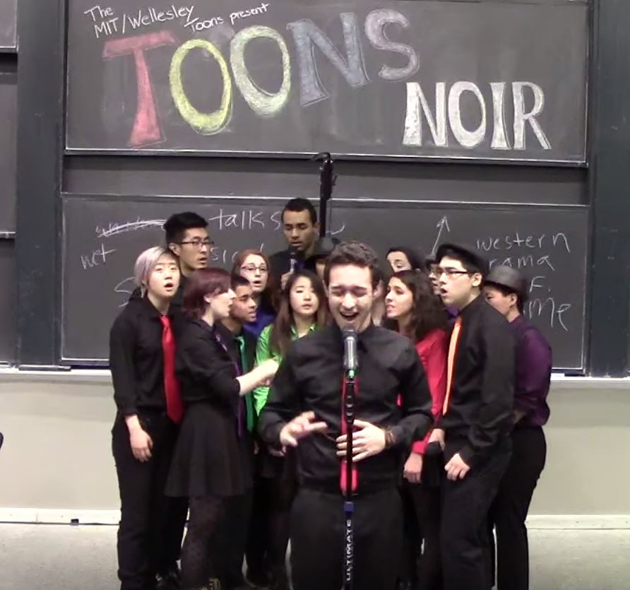

# Projects

## In Progress

### Adder(f)all
**Status:** Completed, In Rehearsal

A short, sololess arrangement for a cappella based on [Tei Shi's Adder(f)all](https://open.spotify.com/track/3tcpDYxRmUe4O3ylYXl1xM).

### Heart-Shaped Birthmark

A short, sololess arrangement for a cappella based on Tei Shi's Heart-Shaped Birthmark.

**Status:** Composition

### TBD

Final Project for 6.111, Introductory Digital Systems Laboratory

**Status:** Ideation

### TBD

Final Project for 4.322, Introduction to 3D Art

**Status:** Ideation

## Completed

### Pressure Sensitive MIDI Controller

_May 2017_

Final Project for 6.115, Microcomputer Project Laboratory

### cycles

_December 2016_

Final Project for 21M.361, Electronic Music Composition I. 
Originally performed in 4 speaker surround sound, this piece is a walk through the repetitive and intense life of an MIT student.

### Past Lives

_October 2016_

An arrangement for a capella based on BØRNS's Past Lives. 

### Water

_September 2015_

An arrangement for a capella based on Andrew Huang's [Water](https://www.youtube.com/watch?v=qptGV7finFo). 

### The Human Joystick
_January 2015_

Project for 16.682, Momentum. 
I worked on a team of four to build a robot which used signals from muscle movements to control a robotic arm. 
As the team's Hardware specialist, I was in charge of assembling the robot, designing how input would be filtered,
and writing programs in C for various functions. I was also the point person for budget management and part acquisition.

### Terrascope: Energy

_December 2014_

### Google Trailblazer

_November 2013_
