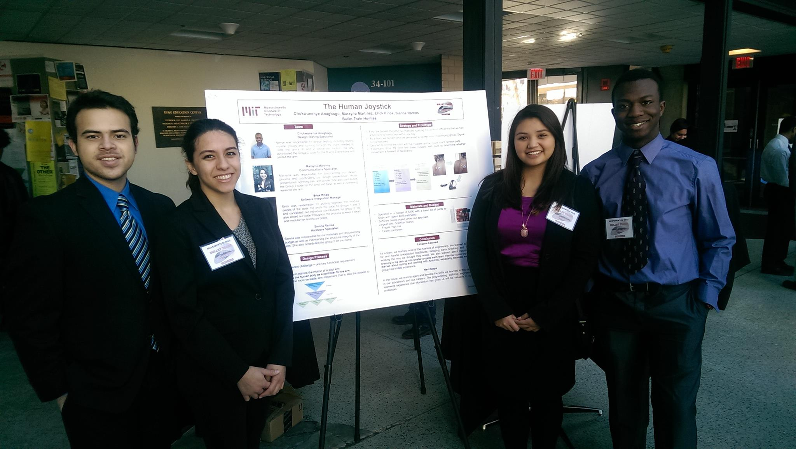

# Projects

## Completed

### FPGA iPad
_December 2017_

Final Project with Alex Leffell for 6.111, Introductory Digital Systems Laboratory.
We are building a program that will rotate, resize, and translate images on a VGA screen. 
The user's pinch and twist finger gestures are recorded by an NTSC camera and translated into commands sent to the image processing module.

### Adder(f)all
_October 2017_

A sololess arrangement for a cappella, based on [Tei Shi's Adder(f)all](https://open.spotify.com/track/3tcpDYxRmUe4O3ylYXl1xM).
Video coming soon.

### Pressure Sensitive MIDI Controller

_May 2017_

Final Project for 6.115, Microcomputer Project Laboratory. 
I created 12 "keys" out of pressure sensitive resistor material,
and connected them to a PSoC microcontroller, which translated key and pressure information into MIDI note and volume information.
I connected a touch screen to the Intel 8051 microcontroller, 
which the user could use to select sound quality information (sine, sawtooth, or square wave), as well as the octave of the note.
All of this information was sent to a laptop running PureData, which consolidated the information from the PSoC and 8051 to generate sounds.

### Introception
_April 2017_

Part of [Xin Liu](http://xxxxxxxxxinliu.com/)'s Master's thesis in the [Fluid Interfaces Group](http://fluid.media.mit.edu/) at the MIT Media Lab.
Xin was studying a person's perception of their body,
and wanted to build a wearable device that would react to a person's breath by
playing back either real-time or delayed breath noises. 
I built the software for the device using Python and Arduino, tested sensors, and helped design the device.
Once the device was built, Xin ran a study testing emotional responses to using the device.
I helped her design the survey, and helped consolidate the data once collected.

### cycles

_December 2016_

[Final Project for 21M.361, Electronic Music Composition I.](https://soundcloud.com/sienna-ramos/cycles-binaural/s-H8xX7)
Originally performed in 4 speaker surround sound, this piece is a walk through the repetitive and intense life of an MIT student.

### Past Lives

_October 2016_

An [arrangement](https://www.youtube.com/watch?v=2XEimrSmRg8) for a capella, based on [BØRNS's Past Lives](https://www.youtube.com/watch?v=Cux2qJjApGA). 

### Water

_September 2015_

An [arrangement](https://www.youtube.com/watch?v=Q3RcMiOQvb4) for a capella, based on [Andrew Huang's Water](https://www.youtube.com/watch?v=qptGV7finFo). 

### The Human Joystick
_January 2015_

Project for 16.682, [Momentum: Brain-Computer Interfaces](https://www.youtube.com/watch?v=3r4bBjWD5IQ). 
I worked on a team of four to build a robot which used signals from muscle movements to control a robotic arm. 
As the team's Hardware specialist, I was in charge of assembling the robot, designing how input would be filtered,
and writing programs in C for various functions. I was also the point person for budget management and part acquisition.
We gave a presentation and a poster session about our project.

### Terrascope: Our Energy Future

_December 2014_

Project for 12.000, [Solving Complex Problems](https://terrascope.mit.edu/).
I researched energy policy in China for my team of 50 to develop an energy portfolio for the world.

### Google Trailblazer: Project ICE

_November 2013_

I was part of a group of students selected by Google to design academic programs to promote computer science.
With my team of five, I planned a platform and forum for students from K-12 where they could compete with each other to complete coding lessons in languages like Scratch, Python, and Java.
